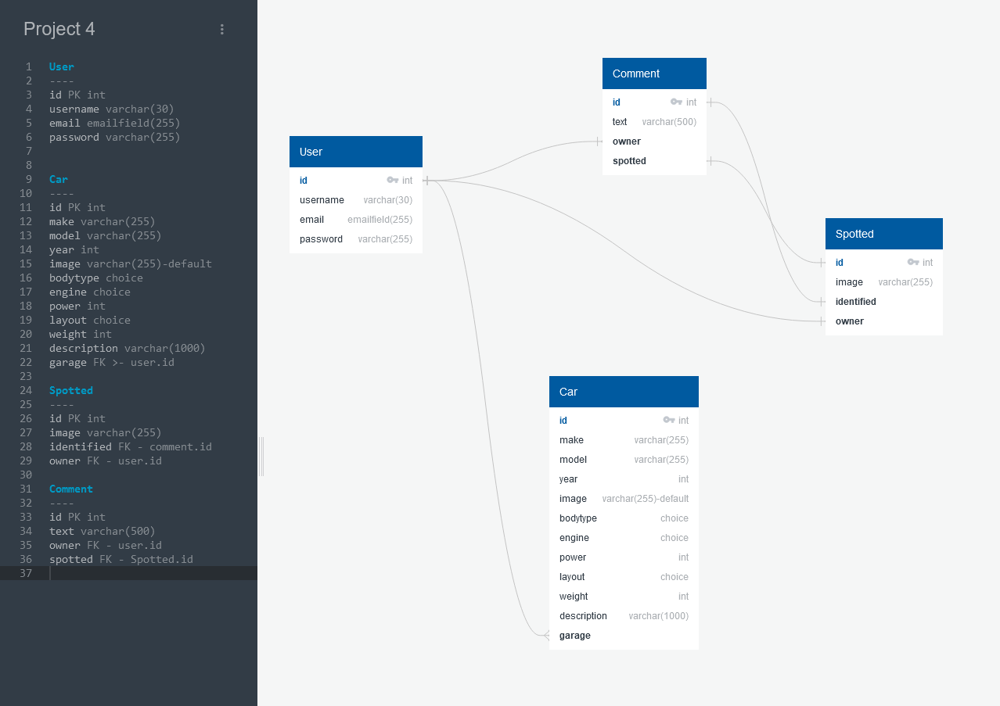
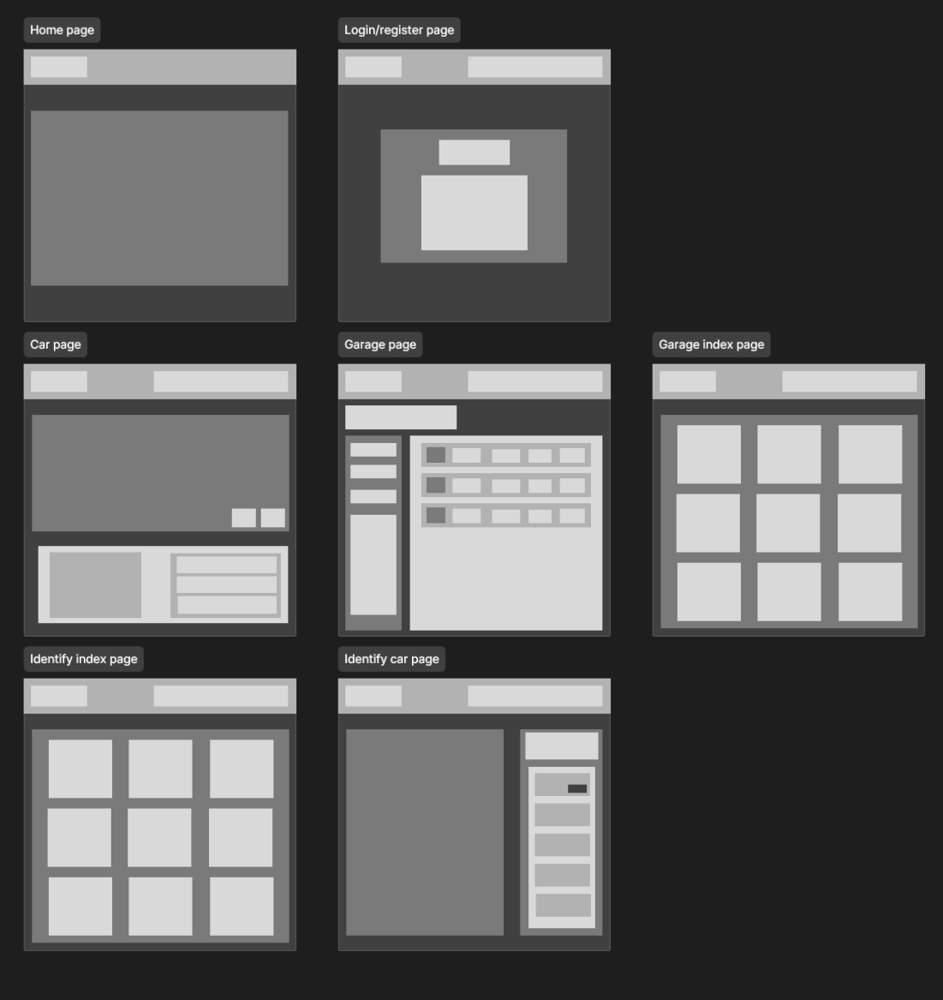
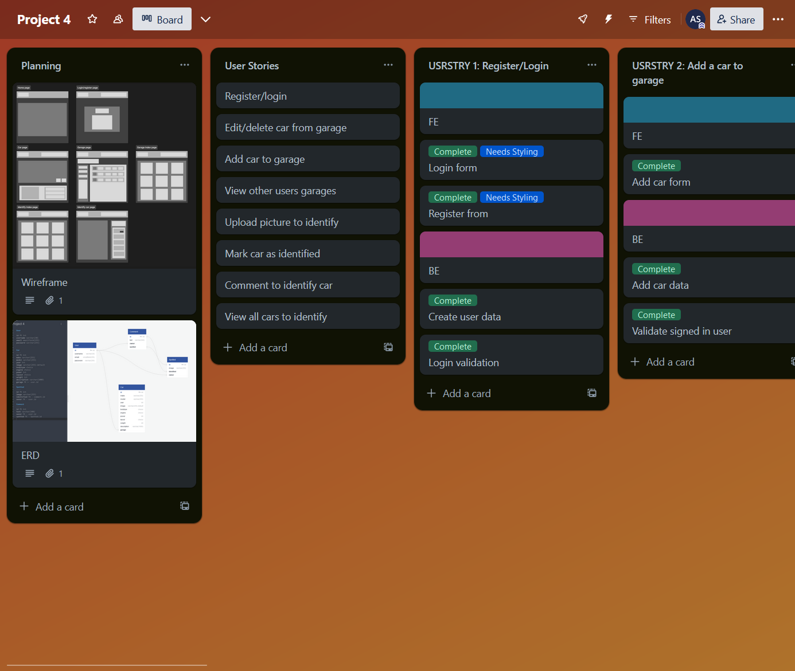

# Virage
A virtual garage and car spotting website

## Description

The purpose of this project was to create a functional back and front end application using JavaScript, React and SCSS using a self made API in Django with an SQL database.

## Deployment link

Please find the website at the following link: 
https://project-virage-7020bf631541.herokuapp.com/

## Getting Started/Code Installation

This code is hosted on Heroku. Please follow the link provided.

## Timeframe & Working Team

The timeframe for this project was 10 days, from Thursday the 11th of January to Monday the 22nd of January. This project was carried out solo.

## Technologies used

Technologies used are as follows:
<li>VS code</li>
<li>Photoshop</li>
<li>Heroku</li>
<li>Firefox</li>
<li>Trello</li>
<li>FigJam and Figma</li>
<li>Neon</li>

Packages for VS code used are as follows:
<li>React</li>
<li>React router dom</li>
<li>Django</li>
<li>Json Web Token</li>
<li>Dotenv</li>
<li>Axios</li>
<li>Sass</li>

## Brief

This project was to test our individual fullstack skills. A fully functioning back end, front end and API was to be made by each of us, with expectations to have a fully functioning and usable website.

### Technical Requirements:

* **Build a full-stack application** by making your own backend and your own front-end
* **Use a Python Django API** using Django REST Framework to serve your data from a Postgres database
* **Consume your API with a separate front-end** built with React
* **Be a complete product** which most likely means multiple relationships and CRUD functionality for at least a couple of models
* **Complex Functionality** like integrating a 3rd party API or using a particularly complex React Component would mean that the CRUD and multiple relationships requirement can be relaxed, speak to your instructor if you think this could be you.
* **Implement thoughtful user stories/wireframes** that are significant enough to help you know which features are core MVP and which you can cut
* **Have a visually impressive design** to kick your portfolio up a notch and have something to wow future clients & employers. **ALLOW** time for this.
* **Be deployed online** so it's publicly accessible.

### Necessary Deliverables

* A **working app** hosted on the internet
* A **link to your hosted working app** in the URL section of your Github repo
* A **git repository hosted on Github**, with a link to your hosted project, and frequent commits dating back to the _very beginning_ of the project
* **A `readme.md` file** with:
    * An embedded screenshot of the app
    * Explanations of the **technologies** used
    * A couple paragraphs about the **general approach you took**
    * **Installation instructions** for any dependencies
    * Link to your **user stories/wireframes** – sketches of major views / interfaces in your application
    * Link to your **pitch deck/presentation** – documentation of your wireframes, user stories, and proposed architecture
    * Descriptions of any **unsolved problems** or **major hurdles** you had to overcome

## Planning

The planning format was lifted from previous projects and adapted.
The website's main relationships were then created in an ERD on QuickDBD to give a basis for the user stories and paths that needed to be followed.
Then a figma wireframe was used to create the plan for the website structure and user stories.
Finally a trello board was created to hold all the information together and help keep track of the tasks as they were completed.

### QuickDBD:

Link:
https://app.quickdatabasediagrams.com/#/d/5bJykE

The ERD model was crucial for laying out functionality on this site due to the use of an SQL database. The model was rectified in planning for simplification and optimisation.

### Wireframe:

Link:
https://www.figma.com/file/PzN7dBfEWTe5VKVkdQSmz5

Wireframes for each page were created in Figma. These were to be simple and manageable, so page functionality was merged to keep the workload down, but the page layouts mostly stayed the same to the wireframes. The final product has a few extra pages that were not on the wireframe for functionality.

### Trello:

Link:
https://trello.com/b/zBO9W9vL/project-4

The trello page was the main documentation for planning and progress during the project. It was used to layout the user stories and keep track of them while coding. There was a bug section, however after testing the website appears to be robust due to its simplicity so this hasn't been populated yet.

## Build/Code Process

The main code is built up of many sub sections separated into 2 main sections. These are the client side and the server side similarly to project 3.

### Client:

The client side consists of the front end the user interacts with, the styling and JavaScript for loading in API data. For the client side, React was used with styling done in SCSS. No additional packages were used for styling.
The front end uses loader functions to retrieve API data. This front end was made to be light on the user side, similar to my project 3 as Neon is slower than other databases we have used in the past. Most of the website's querying is done through the API request, rather than on the client side to help achieve this.
Images were used as references for small icons in the page, but everything was made in photoshop.

**Code showcase:**

Garage:

The code for displaying individual garages used a few conditionals. This mixed with additional styling in css and all of the divs allowed for a page that I was proud of, as it had a neat layout and looked tidy. This page also had validation on it, so the section using the variable owner was used to display the routes for CRUD functionality if the current logged in user is the owner of the item in the request. This functionality is carried over for all crud pages to match the API validation.

The code:

    // & Default function
    export default function Garage(){

      const data = useLoaderData()
      const owner = data.owner.username
      const cars = data.cars
    
      return (
        

          

            

              <h1>{ `${owner}'s Garage` }</h1>
              
{`${cars.length} cars in garage`}

              

              

                <Link onMouseEnter={playHover} onMouseDown={playBack} as={Link} to={`/garages/`}>
                  
← Back to Garages

                </Link>
              

              {getUser() === owner &&
              

                <Link onMouseEnter={playHover} onMouseDown={playPress} as={Link} to={`/garages/addCar`}>
                  
+ Add car

                </Link>
              

              }
            

            <section className='carList'>
              

                

                  Model
                

                

                

                  Year
                

                

                

                  Make
                

                

                

                  Power
                

                

                

                  Drivetrain
                

              

              

                { cars?.length > 0
                ?
                  cars.map(car => {
                    const { id, make, model, bodystyle, power, layout, year } = car
                    return (
                      <Link onMouseEnter={playHover} onMouseDown={playPress}
                      key = {id}
                      as = {Link}
                      to = {`/garages/cars/${id}`}
                      >
                        

                          

                            

                            
 {model}
                          

                          

                          

                            {year}
                          

                          

                          

                            {make}
                          

                          

                          

                            {power} bhp
                          

                          

                          

                            {layout}
                          

                        

                      </Link>
                    )
                  })
                :
                
No cars in garage yet

                }
              

            </section>
          

        

      )
    }

Loaders:

The loaders are mostly the same as project 3, however I started bringing in multiple API requests in a single loader which helped with parts of front end authorisation. The code below brings in the populated user API request that contains the username and user ID for validation, as well as all the cars in the users garage.

The code:

    export async function getGaragedCars(id) {
      const resOwner = await fetch(`/api/users/${id}/`)
      const resCars = await fetch(`/api/cars/garage/${id}/`)
      return json({
        owner: await resOwner.json(),
        cars: await resCars.json(),
      })
    }

### Server:

The server side consists of backend processes and building, such as allowing for CRUD functionality on the API, as well as handling data population from linked data fields in the database.
Using these populated fields, I was able to make single API requests made on the client side returning back the data needed instead of loading large amounts of unused data and then filtering it all out.

**Code showcase:**

Comment GET / POST method:

For managing the comments, the car spotter section has multiple pages with multiple comments all linked to these individual pages, so this part of the ERD had a few relationships to manage. The code below allows a get request to return all the comments related to a specific ID, that is specified in the API request (to be used with the front end API request with the same ID). It also contains a different serializer for the get request to include extra information in each comment. Otherwise, it simply posts to the specified ID like usual.

The code:

    # Path: /comments/cartoid/:cartoid-id/
    # Methods: GET, POST
    class CommentCreateView(CommentListCreateView):
      def get_queryset(self):
        return Comment.objects.filter(car_to_id=self.kwargs['pk'])
      def get_serializer_class(self):
          if self.request.method == 'GET':
            return PopulatedCommentSerializer
          return CommentSerializer
      permission_classes = [IsAuthenticatedOrReadOnly]

User serializer:

The user models were used heavily in this app. They were used for page validation as well as certain page population. Because of this, there was a separate populate request made alongside the register and login requests to get hold of this information. This was called garage serializer as it originally was made for querying garages, but it was used in multiple other areas for front end validation. This was used in order not to query the entire user model with all the additional fields to keep the requests light and fast. 

The code:

    from rest_framework import serializers
    from django.contrib.auth import get_user_model
    User = get_user_model()

    class RegistrationSerializer(serializers.ModelSerializer):
      password = serializers.CharField(write_only=True)
      password_confirmation = serializers.CharField(write_only=True)

      class Meta:
        model = User
        fields = ('id', 'username', 'email', 'password', 'password_confirmation')

      def validate(self, data):
        password = data.get('password')
        password_confirmation = data.pop('password_confirmation')

        if password != password_confirmation:
          raise serializers.ValidationError('Passwords don\'t match.')
        return data

      def create(self, validated_data):
        user = User.objects.create_user(**validated_data)
        return user
    
    class GarageSerializer(serializers.ModelSerializer):
      class Meta:
        model = User
        fields = ('id', 'username')

## Challenges

This project was the first large scale fullstack task carried out solo. With the quick introduction to Django, using it at the beginning of the project proved to be difficult and proved to be time consuming. However, after applying and analysing what is happening mixed with the notes from lectures, it started to become significantly easier and I now prefer using it above mongoose from the previous project.
Time management was a bit of a challenge here, as everything had to be finished by myself, so there were a few points in this project where I simply had to stop and move on and cut down scope to get to where I wanted before the deadline. Things such as my highlighted comment field are not hard to implement, and I have an idea how to do it, but I was much more focused on having the website functional and solid instead. I did plan for this as I had cut down my scope significantly before starting the project in a hope to manage all of it, but I was slightly too short.

## Wins

I am proud of the entire application. The styling came out very well and I still have some areas I want to keep working on. The overall feeling the website gives is exactly what I was aiming for, and I am quite pleased with things such as the garage car list and showroom page.
Additionally, I feel very confident with API methods in django now, and feel like I can manipulate them to a satisfactory standard. Additionally, I feel confident working with foreign keys and populating data as needed in these SQL databases.

## Key Learnings/Takeaways

Most of this project's learning was using Python, and the Django framework for navigating and using the SQL databases. I have learnt a lot about how these relationships work when coded, and also rely heavily on populating data in these keys.

## Bugs

None found so far. Need in depth testing

## Future Improvements

<li>No front end form error handling. If data doesn't match a model, the response is only logged in the console.</li>
<li>Featured comment section doesn't work on the identify page right now.</li>
<li>I want fading page transitions for navigation to add to the website theme.</li>
<li>A reformat of the index pages would be nice.</li>
<li>Button on nav bar that takes the user to their owned garage if signed in.</li>
<li>Add a github link at the bottom of the page.</li>